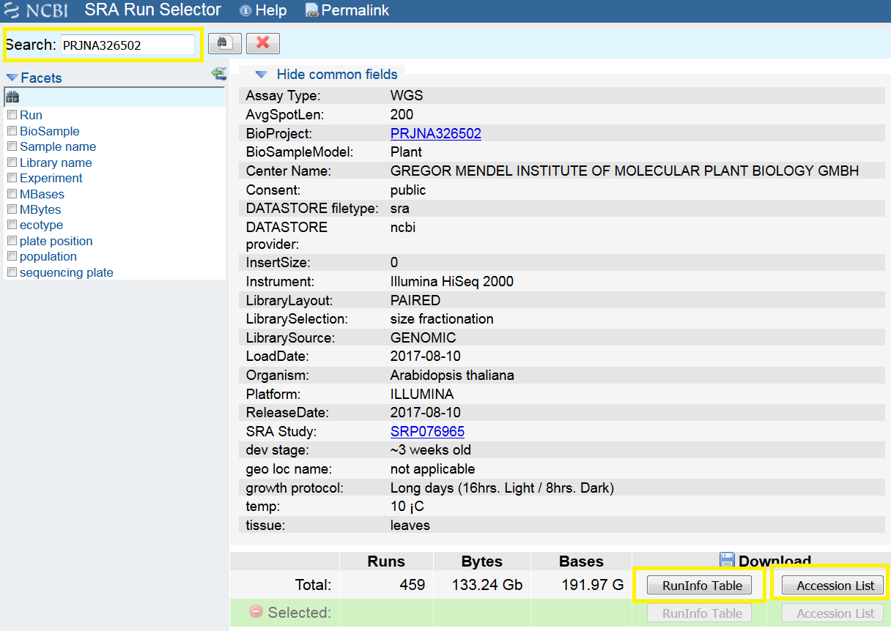

# ncbi_tutorial
How to use the NCBI ressources from the command line and not be lost in the NCBI huge documentation


# Get data from NCBI

Sequencing data are usually in a SRA format and can be fetched using the run number (usually starting with SRR). If you have the run number, go directly to the downloading step. If not, you need to have something which refer to a NCBI archive (BioSample number, Experiment number, project number, ...). The best is to use whatever you have and to search for it at https://www.ncbi.nlm.nih.gov/Traces/study/. If you need to download all SRA files of one project, use the project number (starts with PRJNA), the website will lead you to a page with all the samples within the project and you can from there download the `SraRunTable.txt` file by clicking on 'RunInfo Table'. This file contains all informations about each sample, including the run number which allows you to download the data in sra format. You can also get only the run number by clicking on 'Accession List', giving you the `SRR_Acc_List`. You can directly use the later in a while loop to download your data.



*The 3 important fields for the search and the downloading of the `SraRunTable.txt` and `SRR_Acc_List.txt` are highlighted in yellow.*


# Download the data

There are different ways to download a sra file, you need in all case sratoolkit (should work on Linux and Mac OS X)

## Using prefetch

Get directly the SRA file uploaded locally (per defaul in /home/user/ncbi/public/sra). Check https://www.biostars.org/p/159950/ if you have trouble with disk space quota or go directly to the method using wget.

```
while read name in list; do
	prefetch $name
done < SRR_Acc_List.txt
```

You still need to convert sra into fastq format.

For single-end or paired-end data
```
for i in *sra; do
	fastq-dump --split-3 $i
done
```

Note that you can directly get compressed fastq files by adding the argument `--gzip` to the `fastq-dump` command.

For paired-end data, 2 fastq files will be generated, each having 1 mate.

## Using fastq-dump

Get the fastq file but it goes anyway through a sra cache file in /home/user/ncbi/public/sra so it remains problematic if you have limited space in your home directory.

For single-end data

```
while read name; do
	fastq-dump --split-spot $name
done < SRR_Acc_List.txt

```

*NB: If `--split-spot` argument is used for paired-end data, the sequences of the mate reads will be grouped together in the single output fastq file.

For paired-end data

```
while read name; do
	fastq-dump --split-files $name
done < SRR_Acc_List.txt
```

For paired-end data, 2 fastq files will be generated, each having 1 mate.

## Using wget

In case the home disk space is a problem. Wget is a solution (from https://www.biostars.org/p/159950/). One can directly download a SRA file using this ftp path:
`/sra/sra-instant/reads/ByRun/sra/{SRR|ERR|DRR}/<first 6 characters of accession>/<accession>/<accession>.sra`

Assuming you deal with SRR files:

```
while read i; do
  first_6_chars=$(echo $i | cut -c1-6)
  accession="${i%.*}"
  wget ftp://ftp-trace.ncbi.nih.gov/sra/sra-instant/reads/ByRun/sra/SRR/${first_6_chars}/${accession}/${accession}.sra
done < SRR_Acc_List.txt

```

Then, you need to convert your sra files into fastq files:

```
for i in *sra; do
	fastq-dump --split-3 $i
done
```


## Authors

* **Johan Zicola** - *Initial work* - [johanzi](https://github.com/johanzi)


## License

This project is licensed under the MIT License - see the [LICENSE](LICENSE) file for details


